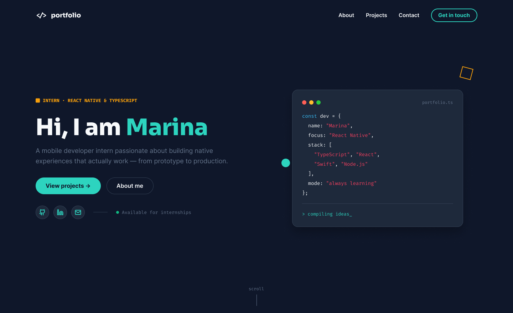
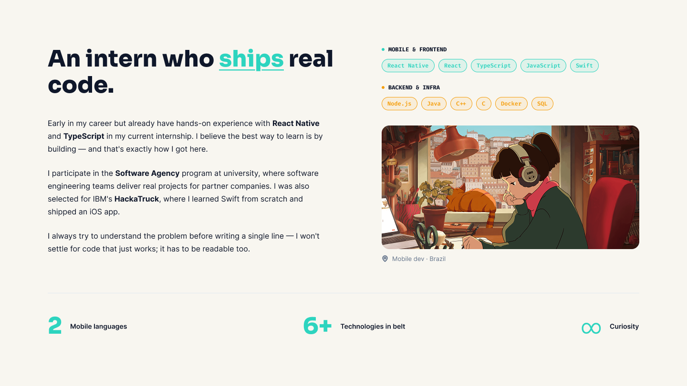
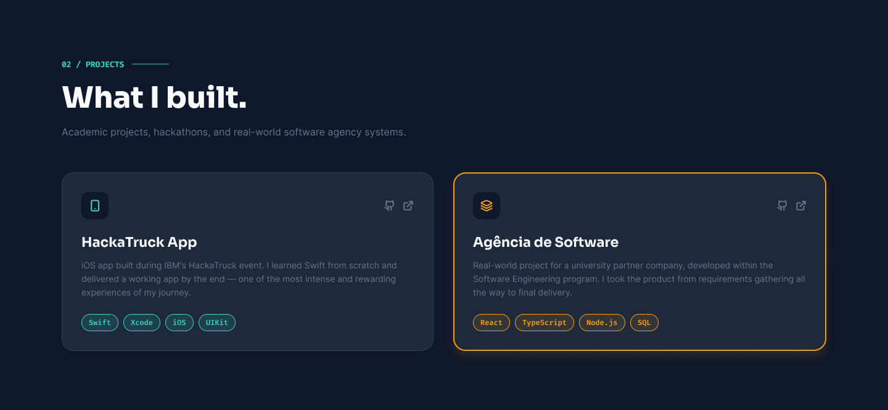
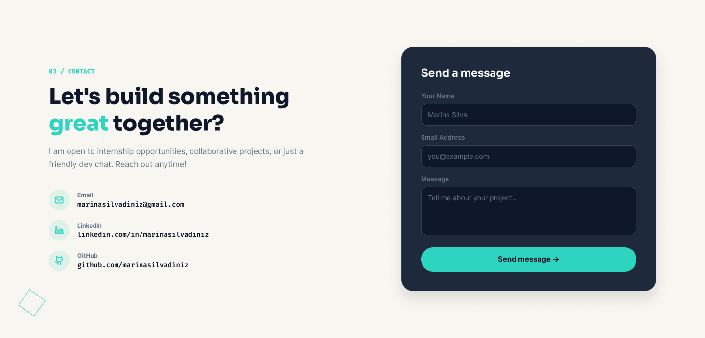

# Our Portfolio

> Portfólio web colaborativo — apresentação profissional, projetos e contato em uma experiência single-page.

Projeto desenvolvido para a disciplina de Laboratório de Desenvolvimento de Software — Engenharia de Software, PUC Coreu, 4º/2026.

---

## 1. Descrição do Projeto

Site de portfólio construído para apresentar a experiência da equipe como desenvolvedores mobile e frontend. O projeto destaca trabalhos com React Native, TypeScript, Swift e tecnologias web, oferecendo ao visitante uma forma clara de explorar os projetos e entrar em contato.

O portfólio foi desenhado como uma experiência **single-page**, limpa, moderna e responsiva. Ele reúne uma seção de introdução (hero), uma seção "sobre" com formação, skills e destaques, uma seção de projetos selecionados com links externos, e um formulário de contato com envio real via Formspree.

**Objetivo geral:** disponibilizar um portfólio profissional público, responsivo e de fácil manutenção, publicado via GitHub Pages.

**Público-alvo:** recrutadores, empresas parceiras e a comunidade técnica interessada nos projetos da equipe.

**Objetivos específicos:**
- Construir um layout responsivo para desktop e mobile;
- Implementar navegação por seções com scroll suave e indicação da seção ativa;
- Apresentar projetos selecionados com stack, descrição e links para repositório/demo;
- Disponibilizar um canal de contato funcional (formulário integrado ao Formspree);
- Publicar o site automaticamente no GitHub Pages.

### Funcionalidades

- Layout responsivo (desktop e mobile) com menu hambúrguer;
- Cabeçalho fixo que reage ao scroll e destaca a seção ativa;
- Hero com apresentação pessoal, bloco de código animado e links sociais;
- Seção *About* com background, skills e destaques;
- Seção *Projects* com trabalhos selecionados e links externos;
- Formulário de contato com envio real via Formspree (estados de envio, sucesso e erro);
- Suporte a deploy no GitHub Pages.

---

## 2. Equipe

| Nome | Função | GitHub |
|------|--------|--------|
| Caio Felix Reis | <FUNÇÃO> | [@caiofelixreis](https://github.com/caiofelixreis) |
| Mariana Tavares | <FUNÇÃO> | [@Mari492](https://github.com/Mari492) |
| Marina Diniz | <FUNÇÃO> | [@MarinaSDiniz](https://github.com/MarinaSDiniz) |
| Milena Araújo |<FUNÇÃO> |                |

---

## 3. Wireframes (Figma — média fidelidade)

O layout do site foi originado de um design no Figma e adaptado para um site funcional.

🔗 **Link do projeto no Figma:** [Link do figma](https://www.figma.com/design/6MuKnq2NU1eqeVKPuGo5Ng/novo-portfolio?node-id=0-1&t=78VPnEboxuxsaq8J-1)

| Seção | Wireframe |
|-------|-----------|
| Home / Hero |  |
| About |  |
| Projects |  |
| Contact |  |

---

## 4. Protótipo do Front-end

🔗 **Deploy (GitHub Pages):** <LINK DO DEPLOY>

| Tela | Captura |
|------|---------|
| Home / Hero |  |
| About |  |
| Projects |  |
| Contact |  |
| Mobile (menu aberto) |  |

---

## 5. Tecnologias Previstas

| Categoria | Tecnologia |
|-----------|-----------|
| Linguagem | TypeScript / JavaScript |
| Framework | React 18 |
| Build / bundler | Vite |
| Estilização | Tailwind CSS + CSS custom properties (tema shadcn) |
| Componentes de UI | shadcn/ui (Radix UI) |
| Ícones | Lucide React |
| Formulário de contato | Formspree |
| Notificações | Sonner |
| Design | Figma |
| Controle de versão | Git + GitHub |
| Hospedagem | GitHub Pages |

---

## 6. Estrutura Inicial do Site

### 6.1 Mapa de navegação

O site é single-page: a navegação acontece por âncoras entre as seções, com scroll suave e destaque da seção ativa.

```
Home (#home)  — hero, apresentação e links sociais
├── About (#about)      — background, skills e destaques
├── Projects (#projects) — projetos selecionados + link para o GitHub
└── Contact (#contact)   — formulário (Formspree) e canais de contato
```

### 6.2 Layout principal

Todas as seções compartilham o mesmo layout base:

```
┌─────────────────────────────────────────────┐
│ CABEÇALHO fixo (logo + nav + menu mobile)   │
├─────────────────────────────────────────────┤
│                                             │
│ ÁREA DE CONTEÚDO                            │
│   #home → #about → #projects → #contact     │
│                                             │
├─────────────────────────────────────────────┤
│ RODAPÉ (créditos + GitHub / LinkedIn / mail)│
└─────────────────────────────────────────────┘
```

- **Cabeçalho:** fixo no topo, com logo, links `about` / `projects` / `contact`, indicação da seção ativa e menu hambúrguer no mobile. Ganha fundo/blur ao rolar a página.
- **Área de conteúdo:** seções full-width com container centralizado e grid responsivo (cards de projeto, grade de skills, formulário).
- **Rodapé:** créditos e ícones de GitHub, LinkedIn e e-mail.

### 6.3 Estrutura de pastas

```
our-portfolio/
├── assets/
│   ├── icon.ico                  # favicon
│   └── photo.jpg                 # foto de perfil
├── docs/
│   ├── wireframes/               # imagens exportadas do Figma
│   └── prototipo/                # capturas do protótipo
├── guidelines/
│   └── Guidelines.md             # diretrizes de design/código
├── src/
│   ├── app/
│   │   ├── App.tsx               # página principal e todas as seções
│   │   └── components/
│   │       ├── ui/               # componentes shadcn/ui (Radix)
│   │       └── figma/            # helpers do design (ImageWithFallback)
│   ├── styles/
│   │   ├── globals.css           # estilos globais
│   │   ├── index.css             # entrada de estilos
│   │   ├── tailwind.css          # camadas do Tailwind
│   │   ├── theme.css             # variáveis de tema
│   │   └── fonts.css             # fontes
│   ├── main.tsx                  # ponto de entrada da aplicação
│   └── vite-env.d.ts
├── default_shadcn_theme.css
├── index.html
├── ATTRIBUTIONS.md
├── .gitignore
└── README.md
```

---

## 7. Como Executar Localmente

```bash
# clonar o repositório
git clone https://github.com/MarinaSDiniz/our-portfolio.git
cd our-portfolio

# instalar dependências
npm install

# rodar em modo de desenvolvimento
npm run dev

# gerar build de produção
npm run build

# publicar no GitHub Pages
npm run deploy
```

Acesse: <http://localhost:5173>

> **Atenção:** `package.json`, `vite.config.ts` e `postcss.config.mjs` estão listados no `.gitignore` e por isso ainda não foram versionados. Eles precisam ser adicionados ao repositório para que os comandos acima funcionem em um clone limpo.

---

## 8. Deploy

O projeto é configurado para GitHub Pages através do campo `homepage` no `package.json` e do script `deploy`.

---

## 9. Status de Entrega — Etapa 1

- [x] Criação do repositório GitHub com README inicial
- [x] Wireframes das páginas no Figma (média fidelidade)
- [ ] Protótipo inicial do front-end (React + TypeScript + Vite + Tailwind)
- [ ] Implementação da navegação (seções e links entre elas)
- [ ] Implementação do layout principal (cabeçalho, rodapé e área de conteúdo)
- [ ] README com imagens dos protótipos, descrição, tecnologias e estrutura

---

## 10. Próximos Passos

- <PRÓXIMO PASSO 1>
- <PRÓXIMO PASSO 2>
- <PRÓXIMO PASSO 3>

---

## 11. Créditos e Licença

Créditos de componentes e recursos de terceiros em [ATTRIBUTIONS.md](ATTRIBUTIONS.md).

Este repositório destina-se a uso acadêmico e de portfólio pessoal.
